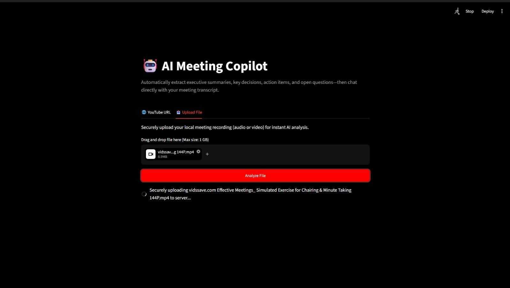
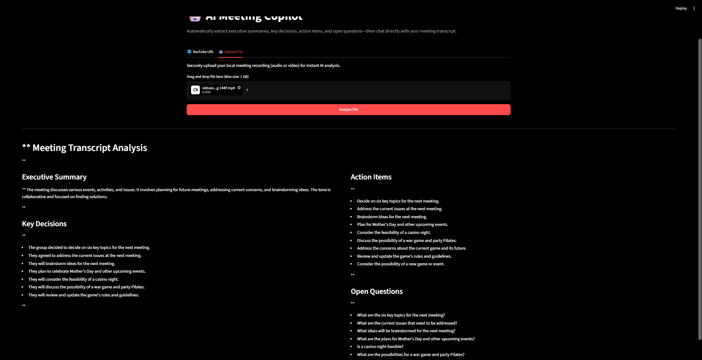
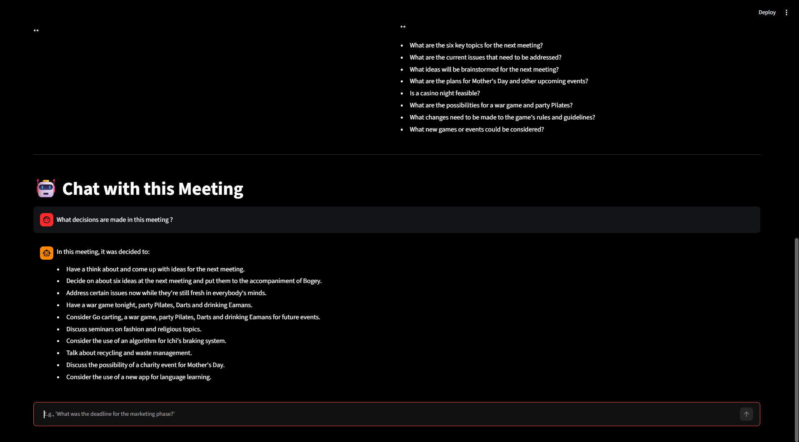

# 🤖 AI Meeting Copilot

### Production-Ready Meeting Intelligence & RAG Platform
An end-to-end AI-powered meeting intelligence platform — built with Whisper, LangChain, Mistral AI,Hugging Face sentence-transformers, FastAPI, and Streamlit, containerized with Docker, and deployed on AWS EC2 — that autonomously transcribes audio/video, extracts structured executive intelligence, and lets you chat with your meeting transcript using a RAG-powered Q&A engine.

**What does this actually do?**
AI Meeting Copilot eliminates information loss from meetings. You provide a  YouTube meeting link or upload a local meeting recording, and the system runs a full on-device transcription pipeline via OpenAI Whisper, generates local embeddings using the Hugging Face `all-MiniLM-L6-v2` sentence-transformer model, indexes the transcript into a ChromaDB vector store, extracts a structured executive report (summary, action items, key decisions, open questions) via Mistral AI and LangChain — and enables natural language Q&A — all delivered in a clean, interactive UI.

---

<div align="center">
  
  
  
  
  
  
  
  
  
  
  
</div>

<br />

## 🖥️ Platform Overview

### Live Dashboard


### Intelligence Analysis Generation


### Intelligence RAG Chat Interface


---

## 📖 Table of Contents

* [🎯 The Value Proposition](#-the-value-proposition)
* [⚙️ System Architecture](#️-system-architecture)
* [🧠 The AI Pipeline](#-the-ai-pipeline)
* [✨ Key Features](#-key-features)
* [🛠 Tech Stack](#-tech-stack)
* [📁 Project Structure](#-project-structure)
* [💻 Quick Start](#-quick-start)
* [📡 API Reference](#-api-reference)
* [☁️ Production Deployment (AWS EC2)](#️-production-deployment-aws-ec2)
* [📝 Environment Configuration](#-environment-configuration)
* [🤝 Contributing](#-contributing)
* [📄 License](#-license)

---

## 🎯 The Value Proposition

Every meeting generates critical information — decisions, deadlines, and action items — that gets lost in hours of unstructured audio. AI Meeting Copilot solves this with a strictly orchestrated multi-stage AI pipeline:

1. **On-Device Transcription:** OpenAI Whisper runs locally on the server — your audio never leaves the machine.
2. **Live Source Support:** Accepts YouTube URLs via `yt-dlp` or direct file uploads — no format friction.
3. **Structured Extraction:** Mistral AI reads the full transcript and produces five structured intelligence sections via LangChain prompt chains.
4. **Semantic Indexing:** The transcript is chunked, embedded with a local Hugging Face model, and loaded into ChromaDB — ready for semantic search.
5. **RAG-Powered Q&A:** Natural language questions are answered strictly from transcript context, preventing hallucination.
6. **Clean Delivery:** A FastAPI backend packages all outputs into a structured JSON payload, delivered instantly to the Streamlit UI.

---

## ⚙️ System Architecture

AI Meeting Copilot is engineered as a decoupled, containerized application. The frontend and backend run in completely isolated Docker environments, connected via an internal network bridge.

```text
            [ User Web Browser ]
                   ▲  │
        Response   │  │  HTTP Request (Port 8501)
                   │  ▼
┌──────────────────────────────────────────────────┐
│          AWS Cloud / Docker Environment           │
│                                                  │
│              [ Streamlit Frontend ]              │
│                      ▲  │                        │
│          JSON Response│  │ Internal Network       │
│                      │  ▼ (Port 8000)            │
│                                                  │
│              [ FastAPI Backend ]                 │
│                      ▲  │                        │
│                      │  ▼                        │
│         ┌────────────────────────────┐           │
│         │   LangChain Orchestrator   │           │
│         │   (The Action Pipeline)    │           │
│         └───┬──▲──────────┬──▲───────┘           │
└─────────────┼──┼──────────┼──┼───────────────────┘
              │  │          │  │
              ▼  │          ▼  │
       [ Mistral AI ]  [ ChromaDB + HuggingFace ]
                         [ Whisper (Local STT) ]
```

---

## 🧠 The AI Pipeline

AI Meeting Copilot processes every request through a four-step, strictly sequenced execution pipeline.

### 1️⃣ Audio Acquisition
- **Engine:** `AudioProcessingService` + `yt-dlp` + `FFmpeg`
- **Action:** Detects whether the source is a YouTube URL or a local file. For YouTube, downloads the best-quality audio stream and converts it to WAV via FFmpeg. For uploads, saves the file temporarily to disk.

### 2️⃣ On-Device Transcription
- **Engine:** OpenAI Whisper (local model)
- **Action:** Loads the Whisper model into memory on first request (lazy loading). Transcribes the WAV file entirely on-device — zero external audio API calls, full data privacy.

### 3️⃣ Insight Extraction
- **Engine:** `MeetingIntelligenceService` + LangChain + Mistral AI
- **Action:** Sends the raw transcript through a structured LangChain prompt chain. Mistral AI extracts five clearly defined intelligence sections: Title, Executive Summary, Action Items, Key Decisions, and Open Questions.

### 4️⃣ RAG Indexing & Q&A
- **Engine:** LangChain Text Splitter + HuggingFace Embeddings + ChromaDB
- **Action:** Chunks the transcript (1000 chars, 200 overlap), embeds each chunk using `all-MiniLM-L6-v2` locally, and stores in ChromaDB. On each chat query, retrieves the top-3 semantically similar chunks and passes them as context to Mistral AI — answers are grounded strictly in transcript content.

### ⚙️ Execution Flow

```text
         [ FastAPI Endpoint ]
                  │
                  ▼ (YouTube URL / File Upload)
    ┌──────────────────────────────────────┐
    │ 1️⃣  Audio Acquisition               │
    │     (yt-dlp + FFmpeg)                │
    └──────────────┬───────────────────────┘
                   │ Returns WAV file path
                   ▼
    ┌──────────────────────────────────────┐
    │ 2️⃣  On-Device Transcription         │
    │     (OpenAI Whisper — Local)         │
    └──────────────┬───────────────────────┘
                   │ Returns raw transcript text
                   ▼
    ┌──────────────────────────────────────┐
    │ 3️⃣  Insight Extraction              │
    │     (LangChain + Mistral AI)         │
    └──────────────┬───────────────────────┘
                   │ Returns structured intelligence
                   ▼
    ┌──────────────────────────────────────┐
    │ 4️⃣  RAG Indexing                    │
    │     (HuggingFace + ChromaDB)         │
    └──────────────┬───────────────────────┘
                   │ Vector store ready for Q&A
                   ▼
     [ Final Structured JSON Payload → UI ]
```

---

## ✨ Key Features

- 🎙️ **On-Device Transcription** — Whisper runs locally; your audio never touches an external API.
- 🌐 **YouTube Support** — Paste any public YouTube URL for instant meeting intelligence.
- 📤 **File Upload Support** — Accepts `.mp4`, `.mp3`, `.wav`, `.m4a`, `.mov` up to 1 GB.
- 📋 **Structured Extraction** — Auto-produces Title, Executive Summary, Action Items, Key Decisions, and Open Questions.
- 💬 **RAG-Powered Chat** — Ask natural language questions; answers are grounded strictly in transcript context.
- 🔒 **Privacy-First** — All transcription and embeddings run locally; only the LLM reasoning call goes to Mistral's API.
- 🐳 **Fully Containerized** — One `docker-compose up` command spins up the entire system.
- ☁️ **Cloud Ready** — Production deployed on AWS EC2.

---

## 🛠 Tech Stack

### AI / ML / NLP
| Tool | Role |
|---|---|
| `openai-whisper` | On-device speech-to-text transcription |
| `Mistral AI` (`open-mistral-nemo`) | LLM for insight extraction & RAG Q&A |
| `sentence-transformers` (`all-MiniLM-L6-v2`) | Local Hugging Face embedding model |
| `LangChain` | LLM orchestration & prompt chaining |
| `langchain-mistralai` | Mistral integration for LangChain |
| `langchain-community` | Sentence Transformer embeddings wrapper |
| `langchain-chroma` | ChromaDB vector store integration |
| `langchain-text-splitters` | Recursive character text splitting |

### Vector Database
| Tool | Role |
|---|---|
| `ChromaDB` | Local vector store for RAG memory |

### Backend
| Tool | Role |
|---|---|
| `FastAPI` | RESTful API framework |
| `Pydantic` | Data validation & schema modeling |
| `Uvicorn` | ASGI server |

### Frontend
| Tool | Role |
|---|---|
| `Streamlit` | Interactive web UI |

### Audio / Video Processing
| Tool | Role |
|---|---|
| `yt-dlp` | YouTube audio downloading |
| `FFmpeg` | Audio conversion (webm/m4a → wav) |

### Infrastructure & DevOps
| Tool | Role |
|---|---|
| `Docker` | Containerization |
| `Docker Compose` | Multi-container orchestration |
| `AWS EC2` | Cloud deployment |

### Utilities
| Tool | Role |
|---|---|
| `python-dotenv` | Environment variable management |
| `requests` | HTTP client in Streamlit frontend |
| `uuid` | Unique temp filename generation |
| `logging` | Structured application logging |

---

## 📁 Project Structure

```
AI-MEETING-COPILOT/
│
├── backend/
│   ├── app/
│   │   ├── core/
│   │   │   └── schemas.py          # Pydantic request/response models
│   │   └── services/
│   │       ├── audio_service.py    # Whisper + yt-dlp transcription pipeline
│   │       └── llm_service.py      # Mistral LLM + LangChain + ChromaDB RAG
│   ├── main.py                     # FastAPI app, routes & middleware
│   ├── downloads/                  # Temp directory for audio files
│   ├── Dockerfile                  # Backend container definition
│   └── requirements.txt
│
├── frontend/
│   ├── app.py                      # Streamlit UI application
│   ├── Dockerfile                  # Frontend container definition
│   └── requirements.txt
│
├── docker-compose.yml              # Multi-container orchestration
├── .env                            # Environment variables (not committed)
├── .gitignore
└── README.md
```

---

## 💻 Quick Start

### Prerequisites
- Python 3.10+
- Docker & Docker Compose
- A **Mistral AI API key** — get one at [console.mistral.ai](https://console.mistral.ai/)
- `FFmpeg` installed on host (only required for local setup without Docker)

---

### Method 1 — One-Click Deploy (Docker Compose) ✅ Recommended

The fastest way to run the full system locally:

**1. Clone the repository and configure environment:**
```bash
git clone https://github.com/your-username/ai-meeting-copilot.git
cd ai-meeting-copilot

# Create your .env file
echo "MISTRAL_API_KEY=your_actual_key_here" >> .env
echo "WHISPER_MODEL=base" >> .env
echo "BACKEND_API_URL=http://localhost:8000" >> .env
```

**2. Spin up all containers:**
```bash
docker-compose up -d --build
```

Access the application at:
- **Frontend (Streamlit):** `http://localhost:8501`
- **Backend (FastAPI):** `http://localhost:8000`
- **API Docs (Swagger):** `http://localhost:8000/docs`

To stop all services:
```bash
docker-compose down
```

---

### Method 2 — Standard Local Setup

**Backend:**
```bash
cd backend
python -m venv venv
source venv/bin/activate        # Windows: venv\Scripts\activate
pip install -r requirements.txt
uvicorn main:app --host 0.0.0.0 --port 8000 --reload
```

**Frontend** (new terminal):
```bash
cd frontend
pip install -r requirements.txt
streamlit run app.py --server.port 8501
```

---

## 📡 API Reference

Full interactive documentation available at `/docs` when the backend is running.

### `GET /health`
Simple service availability probe.

**Response:**
```json
{ "status": "healthy", "engine": "local_whisper" }
```

---

### `POST /api/analyze`
Accepts a YouTube URL or local file path and runs the full analysis pipeline.

**Request Body:**
```json
{
  "source": "https://youtube.com/watch?v=...",
  "language": "english"
}
```

**Response:**
```json
{
  "title": "Q3 Product Roadmap Review",
  "summary": "The team reviewed Q3 milestones...",
  "action_items": "- John to finalize the API spec by Friday...",
  "key_decisions": "- Decided to postpone the v2 launch...",
  "open_questions": "- What is the budget for the marketing phase?"
}
```

---

### `POST /api/analyze-upload`
Accepts a direct multipart file upload (`.mp4`, `.mp3`, `.wav`, `.m4a`, `.mov`).

**Form Data:** `file` — the audio/video file

**Response:** Same structure as `/api/analyze`

---

### `POST /api/chat`
Queries the RAG vector store to answer a natural language question about the meeting.

**Request Body:**
```json
{ "question": "What was the deadline for the marketing phase?" }
```

**Response:**
```json
{ "answer": "The marketing phase deadline was set for the end of October." }
```

---

## ☁️ Production Deployment (AWS EC2)

AI Meeting Copilot is optimized for deployment on Linux cloud instances (e.g., Ubuntu EC2).

### Docker Hub Images

| Service | Image |
|---|---|
| Backend | [`dpk516/copilot-backend:latest`](https://hub.docker.com/r/dpk516/copilot-backend) |
| Frontend | [`dpk516/copilot-frontend:latest`](https://hub.docker.com/r/dpk516/copilot-frontend) |

**1. Establish the internal container network:**
```bash
docker network create copilot-net
```

**2. Deploy the Backend Engine (injecting safe variables):**
```bash
docker run -d \
  --name backend \
  --network copilot-net \
  -p 8000:8000 \
  --env-file .env \
  dpk516/copilot-backend:latest
```

**3. Deploy the Frontend connected to the Backend Bridge:**
```bash
docker run -d \
  --name frontend \
  --network copilot-net \
  -p 8501:8501 \
  -e BACKEND_API_URL=http://backend:8000 \
  dpk516/copilot-frontend:latest
```

---

## 📝 Environment Configuration

| Variable | Container | Purpose |
|---|---|---|
| `MISTRAL_API_KEY` | Backend | API key for Mistral AI LLM reasoning |
| `WHISPER_MODEL` | Backend | Whisper model size: `tiny`, `base`, `small`, `medium`, `large` |
| `BACKEND_API_URL` | Frontend | Internal URL for the FastAPI backend |

> ⚠️ Never commit your `.env` file. It is already listed in `.gitignore`.
> Do not wrap API key values in quotation marks — Docker reads them as part of the key string.

---

## 📄 License

Distributed under the MIT License. See the `LICENSE` file for more information.

---

<div align="center">
  <sub> Maintained by <a href="https://github.com/dpk516">Deepak</a></sub>
</div>
